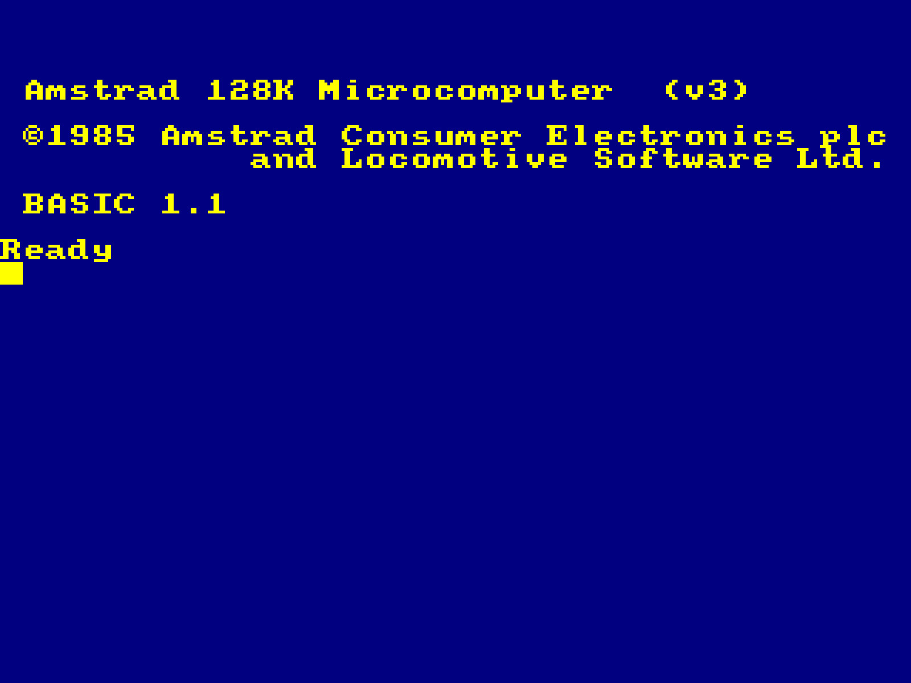
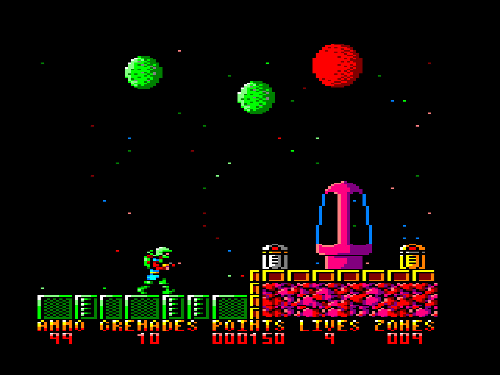
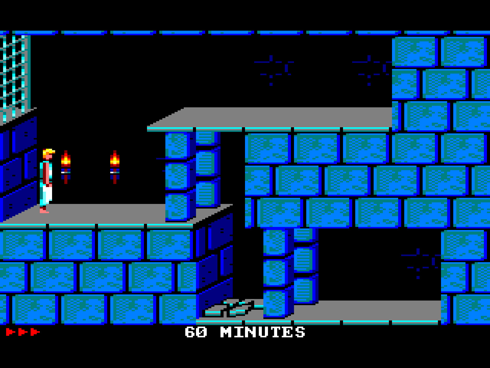
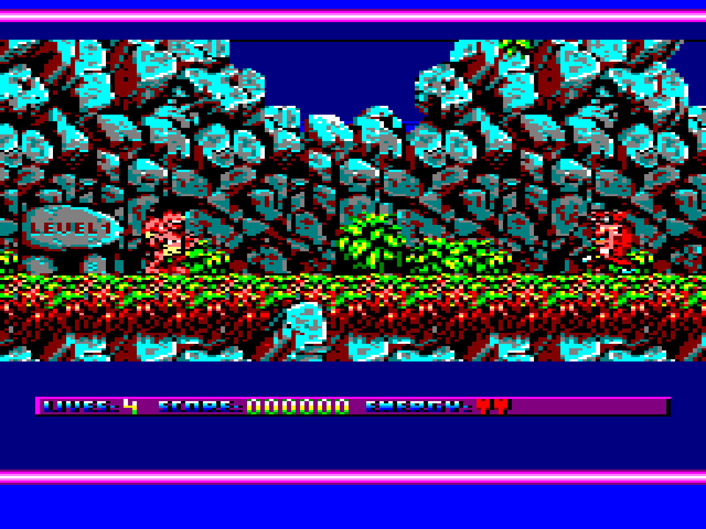
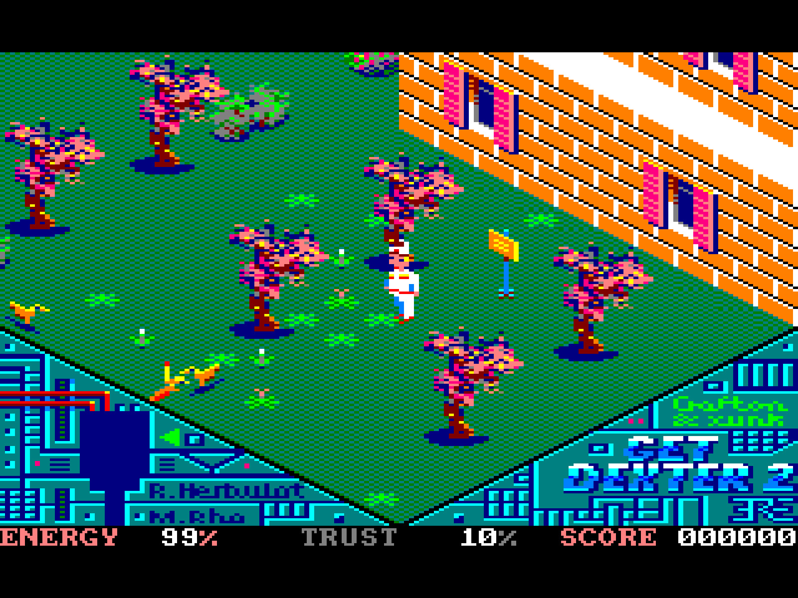

# FRANK CPC

Amstrad CPC 464 / 664 / 6128 emulator for the Raspberry Pi Pico 2 (RP2350). HDMI, VGA, and composite-TV output. SD card file browser. PS/2 keyboard, NES/SNES gamepads, optional USB HID (keyboard, gamepad, XInput). Disk (`.DSK`, `.IPF`), tape (`.CDT`), and cartridge (`.CPR`) loading. Audio over HDMI, I2S, or PWM.

Based on [Caprice32](https://github.com/ColinPitrat/caprice32) by Ulrich Doewich, with the [cpc4x](http://www.amstrad-cpc.de) adapter layer by Ulrich Cordes. IPF disk image support via the [SPS Decoder Library](http://www.softpres.org/) (capsimg).

> **Code heritage:** this project reuses code from several existing CPC emulators and Pico homebrew projects. Caprice32 provides the full emulation core (Z80, CRTC, Gate Array, AY PSG, FDC); cpc4x contributes the dialog and printer adapter layer. Platform drivers (HDMI, composite TV, PS/2, NES pad, USB HID) are adapted from open-source Pico projects — see the [License](#license) section for full attribution.

## Screenshots

| | |
|---|---|
|  |  |
|  |  |
|  | |

## Supported platforms

Three RP2350 boards. Each has its own pin layout and its own set of video and audio backends.

| Platform | Board | Video backends | Audio backends |
|----------|-------|----------------|----------------|
| m2 | [Murmulator 2.0](https://murmulator.ru) / [FRANK](https://rh1.tech/projects/frank?area=about) | HDMI (PIO), HDMI+audio (PIO), VGA (HSTX via DispHSTX), composite TV | HDMI, I2S, PWM |
| m1 | Murmulator 1.x | HDMI (PIO), composite TV | I2S, PWM |
| z0 | [Waveshare RP2350-PiZero](https://www.waveshare.com/rp2350-pizero.htm) | HDMI (PIO) | I2S, PWM |

Select the platform at build time: `PLATFORM=m1 ./build.sh`. Default is `m2`. The build picks the video driver to match and rejects combinations that aren't wired up (HSTX VGA is M2-only, composite TV is M1/M2-only).

## Features

### Emulation

- CPC 464, CPC 664, CPC 6128. Switchable from the settings menu.
- Caprice32 engine: Z80, CRTC, Gate Array, PPI 8255, FDC 765, PSG AY-3-8912, ASIC (CPC Plus).
- Floppy disk images: `.DSK` (standard and extended).
- IPF disk images via the SPS Decoder Library (capsimg) for copy-protected originals.
- Tape images: `.CDT` / `.CAS`. Fast-tape mode for quick loading. Optional GPIO line-in for real cassette decks.
- Cartridge ROMs: `.CPR` (CPC Plus / GX4000 cartridges).
- Configurable RAM: 64 KB, 128 KB, 576 KB.

### Sound

- AY-3-8912 PSG (3 channels).
- Mono and stereo output modes.
- Three audio backends, switchable from the settings menu:
  - HDMI: audio embedded in the HDMI stream. PIO HDMI+audio builds only.
  - I2S: external DAC (recommended for best audio quality). M1/M2 only.
  - PWM: two-pin PWM into an RC low-pass filter. Works on every board, but audio quality is limited — expect noise and reduced fidelity compared to I2S or HDMI.
  - Disabled: silence.

### Video

- CPC Modes 0, 1, 2 (and the undocumented Mode 3).
- 27 hardware colors faithfully mapped.
- Live monitor style: color, green, grey.
- HDMI (PIO) on all platforms. HDMI with audio on M2.
- HSTX VGA on M2 via DispHSTX (640×480).
- Software composite PAL/NTSC on M1/M2.

### Storage

- FAT32 SD card over SPI.
- One directory on the card (`/cpc/disk/`) holds disk and tape images.
- Files are loaded on demand from the loader overlay: disks, tapes, cartridges.
- Settings persisted to the SD card.

### Input

- PS/2 keyboard (PIO bit-bang driver). CPC matrix mapped for UK/US layouts.
- NES and SNES gamepads wired directly. D-pad and buttons map to CPC joystick.
- USB HID: keyboard and gamepad (including XInput). Optional at build time (`USB_HID=1`). Mutually exclusive with USB CDC stdio.
- Ctrl+Alt+Del triggers a CPC reset.

## Hardware requirements

- Raspberry Pi Pico 2 (RP2350) or a compatible board.
- 8 MB QSPI PSRAM. Mandatory. CPC RAM, video buffers, and the emulation state all live in PSRAM.
- HDMI or VGA connector wired to the TMDS pins through 270 Ω resistors. No encoder IC needed.
- SD card socket (SPI).
- PS/2 keyboard. Recommended.
- NES or SNES gamepad, wired directly. Optional.
- I2S DAC (TDA1387, PCM5102, etc.). Optional: PWM audio works without a DAC.

> **USB note:** when USB HID is enabled, the native USB port is used for keyboards and gamepads, and USB CDC stdio is disabled. Use UART on the SWD/UART pins for console output.

### PSRAM

The 8 MB PSRAM is not optional. Three ways to get PSRAM hardware:

1. Solder a PSRAM chip on top of the flash on a Pico 2 clone.
2. Build a [Nyx 2](https://rh1.tech/projects/nyx?area=nyx2), a DIY RP2350 board with integrated PSRAM.
3. Buy a [Pimoroni Pico Plus 2](https://shop.pimoroni.com/products/pimoroni-pico-plus-2?variant=42092668289107), a ready-made Pico 2 with 8 MB PSRAM.

## Pin assignment

| Function       | Signal     | M2  | M1  | Z0  |
|----------------|------------|-----|-----|-----|
| **HDMI / VGA** | CLK−       | 12  | 6   | 32  |
|                | CLK+       | 13  | 7   | 33  |
|                | D0−        | 14  | 8   | 34  |
|                | D0+        | 15  | 9   | 35  |
|                | D1−        | 16  | 10  | 36  |
|                | D1+        | 17  | 11  | 37  |
|                | D2−        | 18  | 12  | 38  |
|                | D2+        | 19  | 13  | 39  |
| **SD card**    | CS         | 5   | 5   | 43  |
|                | SCK        | 6   | 2   | 30  |
|                | MOSI       | 7   | 3   | 31  |
|                | MISO       | 4   | 4   | 40  |
| **PS/2**       | KBD CLK    | 2   | 0   | 14  |
|                | KBD DATA   | 3   | 1   | 15  |
|                | MOUSE CLK  | 0   | —   | —   |
|                | MOUSE DATA | 1   | —   | —   |
| **NES / SNES** | CLK        | 20  | 14  | 4   |
|                | LATCH      | 21  | 15  | 5   |
|                | DATA       | 26  | 16  | 7   |
| **I2S audio**  | DATA       | 9   | 26  | 10  |
|                | BCLK       | 10  | 27  | 11  |
|                | LRCLK      | 11  | 28  | 12  |
| **PWM audio**  | PWM0       | 10  | 26  | 10  |
|                | PWM1       | 11  | 27  | 11  |
| **Tape input** | TAPE IN    | 22  | —   | —   |
| **PSRAM**      | RP2350A    | 8   | 8   | 47  |
|                | RP2350B    | 47  | 47  | 47  |

HDMI/VGA pins connect through 270 Ω resistors. PWM and I2S share pins; the active backend rewires them at runtime. "—" means the function is not available on that platform.

## Usage

### SD card setup

1. Format an SD card as FAT32.
2. Extract `sdcard/cpc.zip` (from this repository) to the **root** of the SD card. This creates the `cpc/` directory tree, including ROM files and the `cpc/disk/` and `cpc/screenshot/` subdirectories.
3. Copy your software into `cpc/disk/`: `.dsk`, `.ipf`, `.cdt`, `.cpr` files. Subdirectories are fine.
4. Insert the card. Power on.

The zip includes all required ROM images (`cpc464.rom`, `cpc664.rom`, `cpc6128.rom`, `amsdos.rom`, `mf2.rom`, `droyal12.rom`).

### During gameplay

- **F11**: loader overlay (disks, tapes, cartridges).
- **F12**: settings menu.
- **Ctrl+Alt+Del**: hard-reset the CPC.
- **Select + Start** on a gamepad: same as F12.

### Settings menu (F12)

| Setting       | Options                                           |
|---------------|---------------------------------------------------|
| Model         | CPC 464, CPC 664, CPC 6128                        |
| Memory        | 64 KB, 128 KB, 576 KB                              |
| Monitor       | Color, Green, Grey                                 |
| Speed         | Preset speed levels                                |
| Limit Speed   | On, Off                                            |
| Sound         | On, Off                                            |
| Volume        | Adjustable                                         |
| Audio Output  | Mono, Stereo                                       |
| Audio Driver  | HDMI, I2S, PWM, Disabled (varies by platform)      |
| Audio In      | File, GPIO line-in                                 |
| Fast Tape     | On, Off                                            |
| ROM           | Select from available ROMs on SD card               |

## Controller support

### PS/2 keyboard

Full CPC keyboard mapping. Special keys:

| PS/2 key             | CPC key / action       |
|----------------------|------------------------|
| F1 – F10             | CPC F1 – F10           |
| Esc                  | ESC                    |
| Tab                  | TAB                    |
| Caps Lock            | CAPS LOCK              |
| Delete               | CLR                    |
| Home                 | COPY                   |
| F11                  | Loader overlay         |
| F12                  | Settings menu          |
| Ctrl+Alt+Del         | Hard reset             |

### NES gamepad

| NES button     | CPC joystick            |
|----------------|-------------------------|
| D-pad          | UP / DOWN / LEFT / RIGHT |
| A              | FIRE 1                   |
| B              | FIRE 2                   |
| Select + Start | Settings menu            |

### SNES gamepad

Auto-detected. A and B map to CPC FIRE 1 and FIRE 2.

### USB HID gamepad / XInput

Standard USB HID gamepads and XInput controllers (Xbox 360, Xbox One, compatible) work when the firmware is built with `USB_HID=1`. D-pad and buttons map to CPC joystick.

## Building

### Prerequisites

1. [Raspberry Pi Pico SDK](https://github.com/raspberrypi/pico-sdk) 2.0+.
   ```bash
   export PICO_SDK_PATH=/path/to/pico-sdk
   ```
2. ARM GCC toolchain (`arm-none-eabi-gcc`).
3. Clone the repo and pull the submodule:
   ```bash
   git clone --recurse-submodules https://github.com/rh1tech/frank-cpc.git
   cd frank-cpc
   ```
   If you already cloned without `--recurse-submodules`:
   ```bash
   git submodule update --init
   ```
   This fetches [frank-hdmi-audio](https://github.com/rh1tech/frank-hdmi-audio), required for the `HDMI_PIO_AUDIO` video driver.

### Build

```bash
./build.sh                                        # Default: M2, PIO HDMI, I2S audio
PLATFORM=m2 HDMI_DRIVER=HDMI_PIO_AUDIO ./build.sh # M2, PIO HDMI with HDMI audio
PLATFORM=m2 HDMI_DRIVER=VGA_HSTX ./build.sh       # M2, HSTX VGA via DispHSTX
PLATFORM=m2 HDMI_DRIVER=COMPOSITE ./build.sh      # M2, software composite TV
PLATFORM=m1 ./build.sh                            # Murmulator 1.x
PLATFORM=z0 ./build.sh                            # Waveshare RP2350-PiZero
USB_HID=1 ./build.sh                              # Enable USB HID input
```

Output: `build/frank-cpc.uf2`.

### Build options

All options are environment variables (or CMake cache entries).

| Variable      | Default     | Effect |
|---------------|-------------|--------|
| `PLATFORM`    | `m2`        | `m1` / `m2` / `z0` |
| `HDMI_DRIVER` | `HDMI_PIO`  | `HDMI_PIO` / `HDMI_PIO_AUDIO` (M2 only) / `VGA_HSTX` (M2 only) / `COMPOSITE` (M1/M2 only) |
| `USB_HID`     | `0`         | `1` enables USB HID host (keyboard, gamepad, XInput). Disables USB CDC stdio. |

### Release build

`release.sh` builds every supported (platform × video) combination at once, always with USB HID enabled:

```bash
./release.sh            # prompts for a version number
./release.sh 1.00       # version 1.00
```

Output goes to `release/`, one UF2 per combination.

### Flashing

With the board in BOOTSEL mode:

```bash
./flash.sh
# or
picotool load build/frank-cpc.uf2
```

## License

Copyright © 2026 Mikhail Matveev &lt;xtreme@rh1.tech&gt;

The frank-cpc port, drivers, and platform layer are licensed under the [GNU General Public License v3.0](LICENSE).

The emulator core components keep their original licenses:

| Component | Author | License | Where |
|-----------|--------|---------|-------|
| Caprice32 (CPC emulation engine) | Ulrich Doewich | GPL-2.0-or-later | `src/cap32/` |
| cpc4x (CPC adapter layer) | Ulrich Cordes | GPL-2.0-or-later | `src/dialogs.c`, `src/printer.c` |
| SPS Decoder Library (capsimg) | KryoFlux / SPS | MAME-style non-commercial | `src/capsimg/` |

Third-party drivers and libraries:

| Component | Author | License | Where |
|-----------|--------|---------|-------|
| FatFS | ChaN | BSD-style permissive | `drivers/fatfs/` |
| pico_fatfs_test SD driver | elehobica | BSD-2-Clause | `drivers/sdcard/` |
| DispHSTX (HSTX VGA) | Miroslav Nemecek | MIT | `drivers/disphstx/` |
| Composite-TV driver | pico-spec (DnCraptor) | GPL-3.0 | `drivers/tv/` |
| PS/2 driver (PIO) | mrmltr | GPL-2.0 | `drivers/ps2/ps2.c`, `ps2.h`, `ps2.pio` |
| TinyUSB + HID host example | Ha Thach | MIT | `drivers/usbhid/hid_app.c`, `usbhid.h`, `tusb_config.h` |
| XInput host | Ryan Wendland | MIT | `drivers/usbhid/xinput_host.*` |
| I2S PIO program | Raspberry Pi Trading Ltd. | BSD-3-Clause | `drivers/audio_i2s.pio` |
| NES pad PIO | shuichitakano / fhoedemakers | MIT | `drivers/nespad/` |
| dlmalloc | Doug Lea | CC0 / public domain | `drivers/dlmalloc.c` |

> **Note on capsimg:** The SPS Decoder Library uses a [MAME-style non-commercial license](src/capsimg/LICENCE.txt). It may not be sold or used in a commercial product. This restriction applies only to the `src/capsimg/` directory and does not affect the GPL-3.0 license of the rest of the project.

## Acknowledgments

Thanks to:

- **Ulrich Doewich** for [Caprice32](https://github.com/ColinPitrat/caprice32) — the Amstrad CPC emulation engine that powers this project.
- **Ulrich Cordes** for [cpc4x](http://www.amstrad-cpc.de) — the original CPC emulator for Linux/X11 whose adapter layer bridges Caprice32 to the platform.
- **Colin Pitrat** for maintaining and modernising Caprice32.
- **KryoFlux / The Software Preservation Society** for the SPS Decoder Library (capsimg) enabling IPF disk image support.
- **DnCraptor** for the pico-spec project (PIO HDMI/VGA and composite-TV drivers).
- **Miroslav Nemecek** for the DispHSTX library.
- **shuichitakano** and **fhoedemakers** for the NES/SNES PIO gamepad driver.
- **ChaN** for FatFS, **elehobica** for the PIO-SPI SD driver.
- **Ha Thach** for TinyUSB, **Ryan Wendland** for the XInput host driver.
- **Doug Lea** for dlmalloc.
- The **Murmulator** community for hardware designs and testing.
- The **Raspberry Pi Foundation** for the RP2350 and the Pico SDK.

## Author

Mikhail Matveev &lt;xtreme@rh1.tech&gt;

[https://rh1.tech](https://rh1.tech) · [GitHub](https://github.com/rh1tech/frank-cpc)
